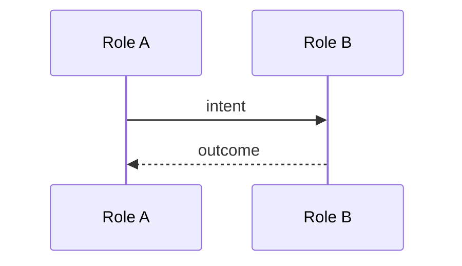
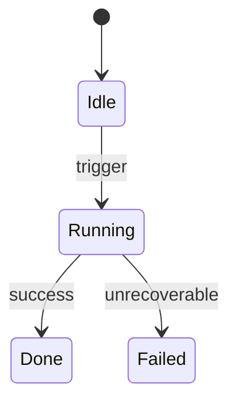

# Subsystem Deep-Dive

Produce one markdown file per subsystem with full behavioral specification: purpose, boundaries, control flow, state, scenarios, non-functional characteristics, observability, security, decisions. Mermaid diagrams are mandatory.

## What counts as a subsystem

A subsystem is **a cohesive set of components that collectively perform one named capability, often spanning multiple layers, that someone would write a runbook or design doc about.**

- ✅ Yes: Evaluations, RAG ingest, the agent loop, the planner, the IaC stack, the auth flow, the tool registry, the retry/backoff system.
- ❌ No: a single utility module, a config file, a one-off script.

If a candidate doesn't pass that bar, suggest documenting it inside a layer doc (`agent-architecture-map`) instead.

## Operating principles

1. **Behavior, not implementation.** Capture *what it does* and *why*, not the code that does it. Diagram nodes are roles ("Planner", "Scorer"), not file paths. Edges are intents ("submits plan"), not function names.
2. **IP-safe by construction.** No verbatim prompts, no proprietary thresholds, no customer-specific schema fields, no named-in-house algorithms. Capture *categories* not *values* for anything sensitive (e.g., "uses a learned confidence threshold for filtering" not "threshold = 0.73"). When in doubt, leave it out and log under Open Questions.
3. **Mermaid is required.** Every subsystem file has at least one diagram. Pick the right type per Diagram-type Map (below); use multiple diagrams if one would conflate concerns.
4. **Control flow is first-class.** Loops, branches, retries, timeouts, concurrency, cancellation, and idempotency get an explicit section — not buried in prose.
5. **In the user's own words.** If you can't explain a stage without quoting code, the abstraction isn't right yet — re-abstract.
6. **Date and verify.** Top of file: today's date and "last verified against code" date. These docs decay; the stamp signals freshness.
7. **Idempotent re-runs.** Update files in place. Preserve user edits inside `<!-- user: --> ... <!-- /user -->` blocks.

## Invocation

- **Named:** user says "deep dive on evaluations" → skill scopes to that subsystem.
- **Discovered:** user says "deep dive a subsystem" with no name → skill reads existing layer docs (from `agent-architecture-map` output) and findings, lists candidate subsystems, asks user to pick.
- **From scratch (design mode):** user says "design a new subsystem for X" → same template, but Boundaries/Decisions/Open Questions get more weight; sequence and control flow are aspirational, not extracted.

## Output

```
docs/architecture/subsystems/<name>.md
```

`<name>` is snake_case (e.g., `evaluations.md`, `agent_loop.md`, `ldf.md`). One file per subsystem.

## File template

```markdown
# Subsystem: <Name>

**Generated:** <YYYY-MM-DD>
**Last verified against code:** <YYYY-MM-DD or "unverified — design mode">
**Spans layers:** Orchestration, Model, Memory  *(from the 7-layer model)*
**Depends on subsystems:** [agent_loop](agent_loop.md), [retry_policy](retry_policy.md)
**Referenced by subsystems:** [evaluations](evaluations.md)

> If this is a cross-cutting concern rather than a discrete subsystem, say so here in one sentence.

## 1. Purpose & scope

One paragraph: what problem this subsystem solves, what it explicitly does *not* do, and who/what depends on it.

## 2. Boundaries (IO contracts)

| Direction | Shape | Source/Destination | Validation |
|---|---|---|---|
| In | <what comes in> | <where from> | <how validated> |
| Out | <what goes out> | <where to> | — |

Side effects (writes, external calls, mutations) listed explicitly.

## 3. Major stages

The 3–7 logical phases this subsystem moves through. Each:

- **Trigger:** what causes entry
- **Action:** what changes
- **Exit:** what causes transition

## 4. Sequence (happy path)



Use `par/and` blocks if any concurrency exists. Otherwise the diagram is misleading.

## 5. Control flow

Explicit, not buried. Cover each that applies:

- **Loops:** what loops, max iterations, exit conditions, what happens on overflow
- **Branches:** decision points with the *condition* that drives each branch (not just "if/else")
- **Retries:** max attempts, backoff strategy, idempotency guarantees, what makes an error retryable
- **Timeouts:** where, value (category, not exact ms unless non-sensitive), fallback on expiry
- **Concurrency:** fan-out points, join semantics, what happens on partial failure
- **Cancellation:** how a run is aborted, what cleanup happens, who can cancel
- **Idempotency:** can this subsystem be safely re-run? What state survives, what doesn't?

For complex branching (>6 decision nodes), use a **decision table** instead of a flowchart:

| Condition A | Condition B | Action |
|---|---|---|
| true | any | route to X |
| false | true | route to Y |
| false | false | reject |

For loops shown in diagrams, **the exit condition must be labeled on the back-edge**. No mystery infinite-looking arrows.

## 6. State & persistence

What state exists across stages, where it lives, lifetime, recovery on restart.



(Only include if the subsystem has discrete states. Skip otherwise.)

## 7. External dependencies

| Dependency | Used for | Failure mode | Handling |
|---|---|---|---|
| Anthropic API | model calls | rate limit, 5xx | retry with backoff |
| Vector store | retrieval | unavailable | degrade to keyword search |

## 8. Test scenarios (Given / When / Then)

Pin behavior precisely without exposing internals.

- **Given** retries=3 and tool returns 500 twice
  **When** the subsystem runs
  **Then** it succeeds on attempt 3 and emits one trace event per attempt

- **Given** input violates schema
  **When** the subsystem is invoked
  **Then** it rejects with a structured error and writes no state

Aim for 3–8 scenarios covering happy path + 2–3 most consequential failures.

## 9. Non-functional characteristics

| Aspect | Target / Observation |
|---|---|
| Latency budget | <p50 / p95 categories — "sub-second", "single-digit seconds"> |
| Throughput | <category — "tens/sec", "thousands/day"> |
| Cost per invocation | <category — "<$0.01", "~$0.10"> |
| Scale limits | <known ceilings> |
| Resilience | <single-region, multi-region, etc.> |

Use *categories* not exact numbers when values are sensitive.

## 10. Observability

| Signal | What it captures | Where it lands |
|---|---|---|
| Log: `<event_name>` | <what's recorded> | <log sink> |
| Trace: `<span_name>` | <span attributes> | <tracing backend> |
| Metric: `<metric_name>` | <unit, aggregation> | <metrics backend> |

Capture **signal names and intent**, not log contents. List gaps explicitly under Open Questions.

## 11. Security & data handling

- **Sensitive data touched:** <categories — PII, PHI, secrets, customer content; or "none">
- **Auth at boundaries:** <how callers authenticate; how this subsystem authenticates to dependencies>
- **Sanitization / redaction:** <if any, where applied>
- **Audit trail:** <what's logged for compliance>
- **Trust assumptions:** <what this subsystem assumes about its callers / inputs>

## 12. Design decisions

For each non-obvious choice:

- **Decision:** <what was chosen>
- **Alternatives considered:** <briefly>
- **Reasoning:** <why this one; what constraint drove it>

Reasoning is usually IP-safe (the *thinking*), but be careful: if the reasoning reveals proprietary IP (e.g., specific business rules), capture the *shape* not the *specifics*.

## 13. Open questions / known limits

- Things the docs/code can't fully answer
- Known brittle spots
- TODOs surfaced during the deep-dive
- "Unknown" markers for parts that couldn't be determined

## Validation checklist

Items the skill is least confident about. Confirm or correct before relying on this doc:

- [ ] Subsystem boundary is accurate (nothing missing, nothing over-claimed)
- [ ] Sequence diagram covers the *real* happy path, not an idealized one
- [ ] Control flow section: every loop has a labeled exit; every retry has a max
- [ ] Test scenarios match observed behavior
- [ ] Non-functional values are correctly categorized (not exposing sensitive numbers)
- [ ] Security section: sensitive-data categories are correct
- [ ] Cross-links to other subsystems and layers are accurate

<!-- user:
Notes, corrections, decisions made after review. Preserved on re-run.
-->
<!-- /user -->
```

## Diagram-type map

| Mermaid type | Use for |
|---|---|
| `sequenceDiagram` | Cross-component flows over time. **Default for "show the flow."** Use `par/and` for concurrency. |
| `flowchart` (TD/LR) | Branching logic with conditions. Switch to decision table at >6 decision nodes. |
| `stateDiagram-v2` | Discrete states and transitions (agent loop, job lifecycle, retry state). |
| `erDiagram` | Persistent data shapes at boundaries (rare; only when schema is essential). |
| `classDiagram` | Skip unless contracts genuinely warrant it. |
| `gantt` / `timeline` | Skip. |

Rules:
- Every diagram describes **behavior**, not file structure.
- Loops in diagrams must label their exit condition.
- Concurrency must use `par/and`; never represent parallel branches as sequential.
- One canonical happy path per diagram; error paths annotated with `Note over X: on failure, …` or in a second diagram.
- Plain Mermaid only — no themes, no extensions.

## Cross-cutting acknowledgment

If a "subsystem" is actually a cross-cutting concern (e.g., evaluations often cut across orchestration + model + memory + observability), say so in the opening callout. Don't pretend it's a discrete component when it isn't. The doc is still valuable — it just admits the shape honestly.

## Inputs the skill accepts

- `name` (optional) — subsystem name; if absent, the skill discovers candidates and asks
- `output_dir` (optional, default `./docs/architecture/subsystems/`)
- `mode` (optional, default `extract`) — `extract` (from existing code) | `design` (for new subsystems)
- `layers` (optional) — layers this subsystem is expected to span, used as scoping hint when extracting

## Relationship to other skills

- Reads from (if present): `docs/architecture/00-overview.md`, layer docs `01-…07-…md`, findings `99-findings.md`, trees `_trees/*.md`
- Writes to: `docs/architecture/subsystems/<name>.md` only
- Layer docs from `agent-architecture-map` should backlink to subsystem docs in their "Key components" section when a subsystem is captured. The skill will append a one-line cross-link to relevant layer docs (under a `## Subsystems` heading) but does not otherwise modify them.

## What this skill does NOT do

- Does not read or capture verbatim prompts, configs, or proprietary algorithms
- Does not modify source code
- Does not produce one file for every small component — only genuine subsystems
- Does not invent behavior the code/docs don't support; gaps go to Open Questions
- Does not use diagram types beyond the Diagram-type Map